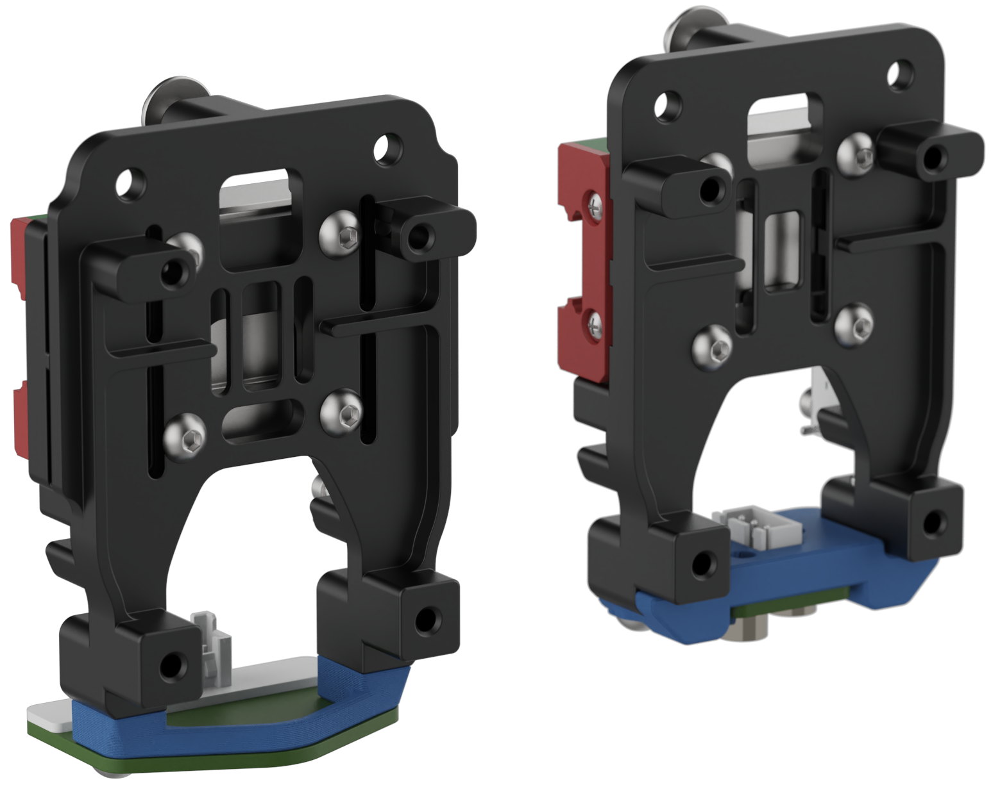

# CNC Xol-Carriage - Version 2

## Comming Soon™️

The official version 2 of CNC Xol-Carriage by:  [DW-Tas](https://github.com/DW-Tas)   
A CNC version of Xol-Carriage for stock Voron v2.4 / Trident and Monolith Gantry printers. 
Manufactured by LDO. 
 

 
 
 

## Frequently Asked Questions (FAQ)

<dl>

  <dt>When can I buy it?</dt>
  <dd>The CNC carriage is expected to begin manufacturying in mid October 2026. A firm release date is not currently known. Comming Soon™️</dd>

  <dt>What gantry configurations are supported by Version 2 CNC Xol-Carriage</dt>
  <dd>Version 2 Xol-Carriage comes in two types 
   ~ Monolith Gantry (up to 12mm belts) 
   ~ Voron stock gantry (6mm belts only)</dd>

  <dt>Do I need printed parts?</dt>
  <dd>Yes. You need to print a probe module from the <a href="./Probe_Modules/">Probe_Modules</a> folder in this repository for your probe type</dd>

  <dt>What probe types are supported</dt>
  <dd>There are curently probe modules for: 
   ~ Beacon / Cartographer 
   ~ Klicky 
   ~ PCB Klicky</dd>

  <dt>What is the Y offset for Becaon/Cartographer with A4T/Xol</dt>
  <dd>The Y offiset is 24mm</dd>

  <dt>Do I need different screws to attach to the MGN12 carriage</dt>
  <dd>Yes, but kits will include the correct hardware. 
   ~ The stock Voron type is attached with M3x6 BHCS 
   ~ The Monolith Gantry type is attached with M3x8 BHCS</dd>

</dl>

 
 

## Credits

The Monolith Gantry version includes the Monolith CNC Universal belt clamp by [CloakedWayne](https://github.com/CloakedWayne).

 
 

> [!TIP] 
> ### You can help support the development of my projects. 
> Donate at https://ko-fi.com/dwtas 

  

